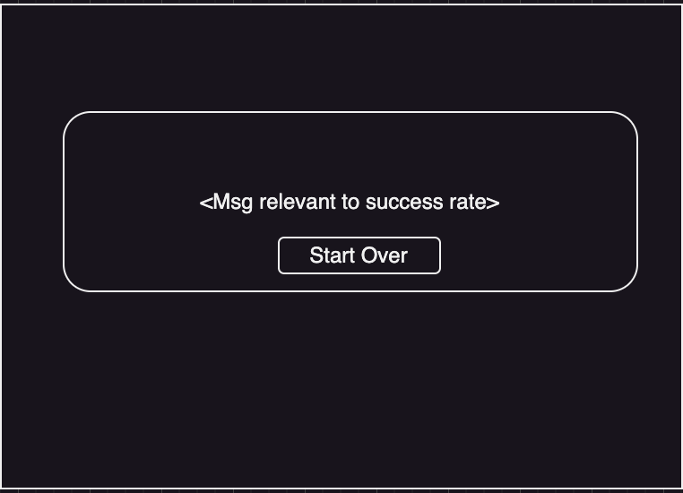

# Getting Started With for Technical Interview Assignment for Full-Stack Dev @ Codebashing

Hi, Welcome :) And thank you for taking the time and effort for doing this assignment.
The goal of the assignment is for us to assess your technical skills as a FullStack Developer.
It includs mainly working on a client side repository and creating a mini version of "Who wants to be a millionaire?"
type of questionaire.

# Goal
Build a page where there will be 4 sections:
1. Displaying questions
2. User inputing the answers
3. Displaying users' name
4. Displaying total score and percentage of correctly answered questions at the end of the quiz
5. If the success rate is lower than 50% display to the user to "Try Again and improve".
6. If the success is more than 50% but lower than 90%, display to the user "Nice attempt but try again".
7. If the success is above 90%, display "Way to go Champ!!"

Here's a mockup of the design:

## How to run this assignment:
In the project directory, you need to run `npm install`, `npm start` and `json-server --watch...`(described below).
the json-server and the `npm start` should be run in a separate terminal to work together.

### `npm install`
Setups modules for project, feel free to add your own if needed.
### `npm start`
Runs the app in the development mode.\
Open [http://localhost:3000](http://localhost:3000) to view it in your browser.

### `json-server --watch src/db.json --port 3030`
Runs the simulated backend for the project, it uses the following library: [json-server](https://github.com/typicode/json-server)
These are the routes that are availble for this task:
`http://localhost:3030/user`
`http://localhost:3030/questions/[1-3]`
`http://localhost:3030/correct_answers/[1-3]`